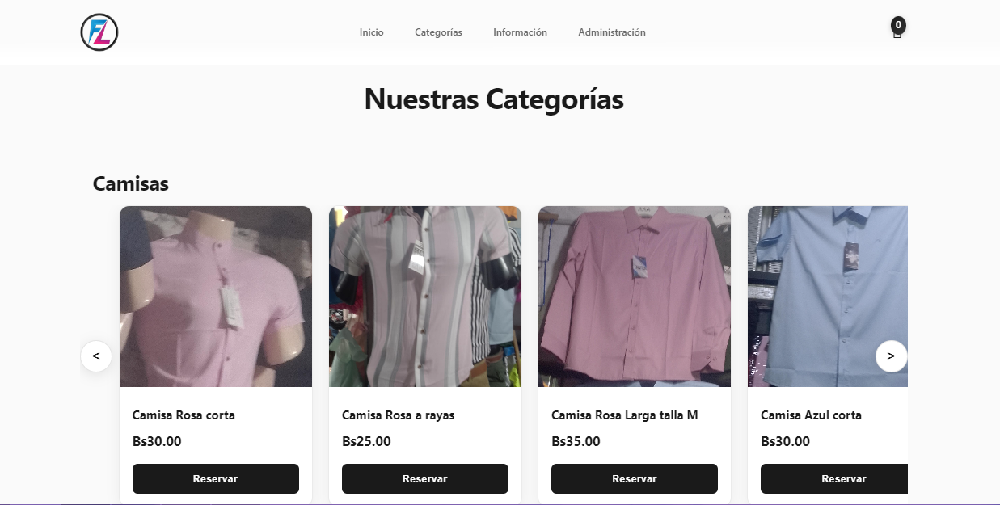
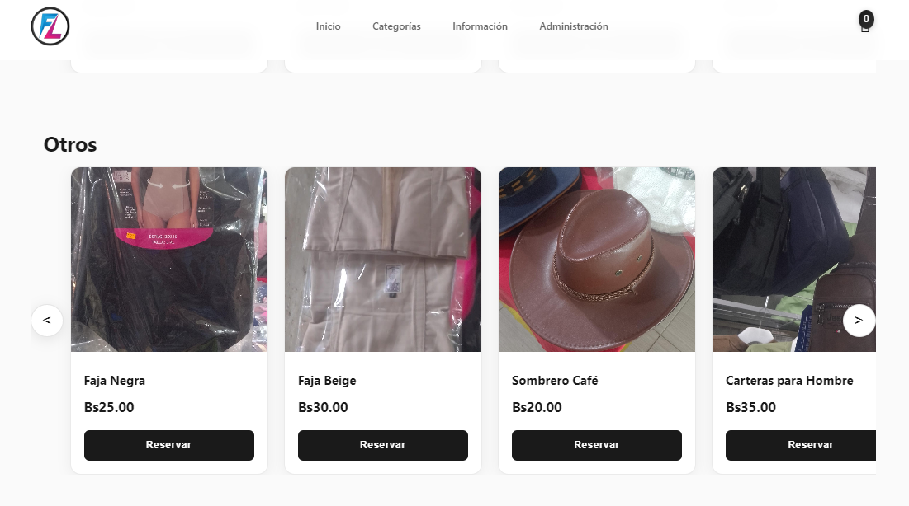

# FashionLink Website Project

This project implements a simple clothing reservation website with an administrative panel, built using HTML, CSS, JavaScript for the frontend, and PHP with MySQL for the backend.

## Features

- **Product Catalog**: Display products organized by categories with infinite carousels
- **Reservation System**: Customers can reserve products (one per product limit)
- **Shopping Cart**: Shows reserved items and total price
- **Customer Form**: Collects customer information for reservations
- **WhatsApp Integration**: Automatically sends reservation details to seller's WhatsApp
- **Admin Panel**: Secure login to manage products (add, edit, delete)
- **Responsive Design**: Works on desktop and mobile devices

## Database Structure

**Database Name:** `fashionlink_db`

**Table: `products`**
This table stores information about the clothing products available for reservation.

| Column Name    | Data Type     | Constraints           | Description                               |
|----------------|---------------|-----------------------|-------------------------------------------|
| `id`           | INT           | PRIMARY KEY, AUTO_INCREMENT | Unique identifier for the product         |
| `name`         | VARCHAR(255)  | NOT NULL              | Name of the clothing item                 |
| `description`  | TEXT          | NULLABLE              | Optional description of the item          |
| `price`        | DECIMAL(10, 2)| NOT NULL              | Price of the clothing item                |
| `category`     | VARCHAR(100)  | NOT NULL              | Category of the clothing item (e.g., 'Camisas', 'Pantalones') |
| `image_url`    | VARCHAR(255)  | NOT NULL              | URL or path to the product image          |
| `stock`        | INT           | NOT NULL, DEFAULT 1   | Available stock for the product (for reservation logic) |

**Table: `reservations`**
This table stores information about customer reservations.

| Column Name    | Data Type     | Constraints           | Description                               |
|----------------|---------------|-----------------------|-------------------------------------------|
| `id`           | INT           | PRIMARY KEY, AUTO_INCREMENT | Unique identifier for the reservation     |
| `product_id`   | INT           | NOT NULL, FOREIGN KEY (products.id) | ID of the reserved product                |
| `customer_name`| VARCHAR(255)  | NOT NULL              | Name of the customer making the reservation |
| `customer_email`| VARCHAR(255)  | NOT NULL              | Email of the customer                     |
| `customer_phone`| VARCHAR(50)   | NOT NULL              | Phone number of the customer              |
| `additional_notes`| TEXT          | NULLABLE              | Any additional notes from the customer    |
| `reservation_date`| TIMESTAMP     | DEFAULT CURRENT_TIMESTAMP | Date and time of the reservation          |

## Project Directory Structure

```
fashionlink/
├── index.html              # Main website page
├── style.css               # Main stylesheet
├── script.js               # Frontend JavaScript functionality
├── .htaccess               # Apache configuration for security and performance
├── sample_data.sql         # Sample data for testing
├── README.md               # This file
├── images/                 # Product images directory
│   ├── *.jpg               # Sample product images
│   └── *.webp              # Sample product images
└── php/                    # Backend PHP scripts
    ├── config.php          # Database connection and configuration
    ├── get_products.php    # API to fetch products
    ├── make_reservation.php# API to handle reservations
    └── admin/              # Admin panel
        ├── index.php       # Admin login page
        ├── dashboard.php   # Admin dashboard
        ├── manage_products.php # API to add, edit, delete products
        └── auth.php        # Authentication logic
```

## Setup Instructions

### 1. Database Setup

1. Start XAMPP and ensure MySQL is running
2. Open phpMyAdmin (usually at http://localhost/phpmyadmin)
3. Create a new database named `fashionlink_db`
4. Run the following SQL commands:

```sql
CREATE DATABASE fashionlink_db;

USE fashionlink_db;

CREATE TABLE products (
    id INT AUTO_INCREMENT PRIMARY KEY,
    name VARCHAR(255) NOT NULL,
    description TEXT,
    price DECIMAL(10, 2) NOT NULL,
    category VARCHAR(100) NOT NULL,
    image_url VARCHAR(255) NOT NULL,
    stock INT NOT NULL DEFAULT 1
);

CREATE TABLE reservations (
    id INT AUTO_INCREMENT PRIMARY KEY,
    product_id INT NOT NULL,
    customer_name VARCHAR(255) NOT NULL,
    customer_email VARCHAR(255) NOT NULL,
    customer_phone VARCHAR(50) NOT NULL,
    additional_notes TEXT,
    reservation_date TIMESTAMP DEFAULT CURRENT_TIMESTAMP,
    FOREIGN KEY (product_id) REFERENCES products(id)
);
```

5. (Optional) Load sample data by running the SQL commands in `sample_data.sql`

### 2. Configuration

1. Open `php/config.php`
2. Update the database password if your MySQL root user has a password:

```php
define('DB_PASSWORD', ''); // Set your MySQL root password here if applicable
```

### 3. WhatsApp Configuration

1. Open `script.js`
2. Find line 220 and replace the placeholder number with your actual WhatsApp number:

```javascript
const whatsappNumber = '1234567890'; // CHANGE THIS: Replace with your WhatsApp number
```

**Important**: Use the format: country code + number (no + sign, no spaces)
- Example for Mexico: `521234567890`
- Example for USA: `11234567890`

### 4. Admin Panel Access

- **URL**: `http://localhost/fashionlink/php/admin/`
- **Username**: `admin`
- **Password**: `password123`

**Security Note**: Change these credentials in `php/admin/auth.php` before deploying to production.

### 5. File Placement

1. Copy the entire `fashionlink` folder to your XAMPP `htdocs` directory
2. The website will be accessible at: `http://localhost/fashionlink/`

## Usage

### For Customers:
1. Browse products by category using the infinite carousels
2. Click "Reservar" to add items to the cart (one per product limit)
3. Click the cart icon to view reserved items
4. Click "Ir a Reservar" to fill out the reservation form
5. After submitting, click "Ir a WhatsApp" to send details to the seller

### For Administrators:
1. Go to `http://localhost/fashionlink/php/admin/`
2. Login with admin credentials
3. Add, edit, or delete products using the dashboard
4. Manage product images, prices, categories, and stock

## Customization

### Adding New Categories:
1. Edit the category dropdown in `php/admin/dashboard.php` (line ~95)
2. Add your new category option to the select element

### Styling:
- Modify `style.css` to change colors, fonts, and layout
- The main brand color is `#e74c3c` (red) - search and replace to change it

### Product Images:
- Place product images in the `images/` directory
- Use relative paths like `images/your-image.jpg` when adding products

## Troubleshooting

### Common Issues:

1. **Database Connection Error**: 
   - Check if MySQL is running in XAMPP
   - Verify database name and credentials in `config.php`

2. **Images Not Loading**: 
   - Ensure image files are in the `images/` directory
   - Check file permissions
   - Verify image URLs in the database

3. **Admin Panel Not Working**: 
   - Check if sessions are enabled in PHP
   - Verify file permissions for the `php/admin/` directory

4. **WhatsApp Not Opening**: 
   - Verify the phone number format in `script.js`
   - Ensure the number includes country code

## Security Notes

- This is a basic implementation for learning/testing purposes
- For production use, implement proper password hashing
- Add input validation and sanitization
- Use prepared statements (already implemented for database queries)
- Consider implementing HTTPS
- Change default admin credentials

## License

This project is for educational purposes. Feel free to modify and use as needed.
## AUTORAS

SIRLEY CHUVE PEREZ
JHOSELYN LARA HINOJOSA 

## IMAGENES DEL LA PÁGINA





